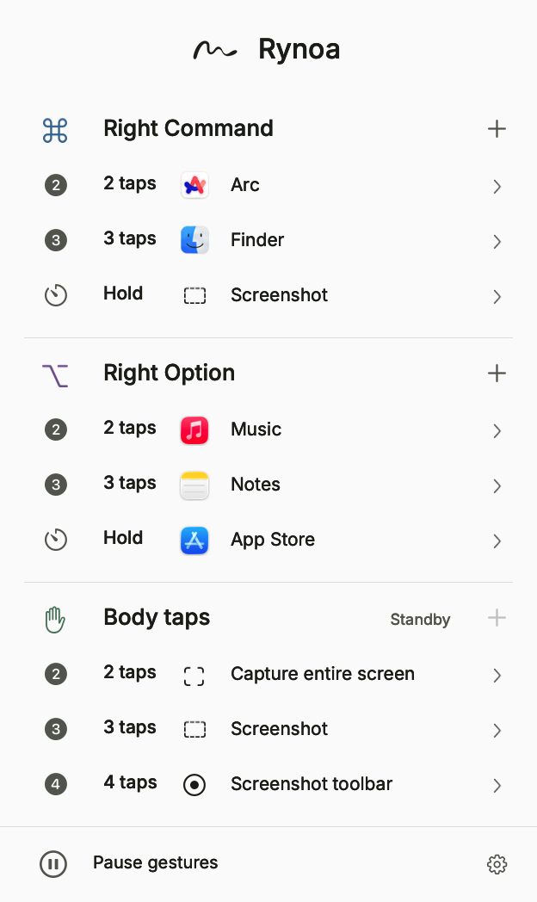

  

<h1 align="center">Rynoa</h1>

<a href="README.md">简体中文</a> · <strong>English</strong>

<strong>Your Mac, a gesture away.</strong>

Tap a right-hand modifier key or gently tap your Mac to run everyday actions.

  <a href="https://rynoa.jinso.top/en">Website</a> ·
  <a href="https://github.com/JinSooo/rynoa/releases/download/v1.0.0/Rynoa-1.0.0.dmg"><strong>Download for Mac</strong></a> ·
  <a href="HELP.en.md">User guide</a> ·
  <a href="https://github.com/JinSooo/rynoa/issues/new/choose">Report an issue</a>

macOS 14+ · Apple Silicon / Intel Current release: v1.0.0

  

English app interface with example bindings. Each gesture can be assigned to your own action.

## Everyday actions in fewer steps

Open an app, bring up Spotlight, take a screenshot, or minimize a window. Rynoa stays in your menu bar so these actions are always close at hand.

| Input | Available gestures |
| --- | --- |
| Right Command ⌘ | Single tap, double tap, triple tap, hold |
| Right Option ⌥ | Single tap, double tap, triple tap, hold |
| Mac body taps | Double, triple, or quadruple tap; no left/right distinction |

Assign each gesture to **open or switch to an app**, **send a custom keyboard shortcut**, or **run a system action** such as volume control, Do Not Disturb, screenshots, or window controls. You can pause all triggers at any time. Your bindings are saved on your Mac.

Body taps depend on your Mac model and macOS version. Hardware validation is currently limited, so support is not guaranteed on every Mac. Tap gently; no force is needed. Keyboard gestures remain available on devices without body-tap support.

## Install and try it

1. [Download the Rynoa DMG](https://github.com/JinSooo/rynoa/releases/download/v1.0.0/Rynoa-1.0.0.dmg). Quit any older version before updating.
2. Open the disk image, drag **Rynoa** into **Applications**, then launch it from Applications.
3. Follow the onboarding instructions to allow **Input Monitoring** and **Accessibility** in **System Settings → Privacy & Security**.
4. Click the Rynoa menu bar icon. Use **+** beside an input group to add a gesture, then choose an action. Click an existing binding to edit it.

App and system-action selections save immediately. After recording a shortcut, click the completion button to save it. Reopen the panel within **5 seconds** to return to the same page with your search and unsaved shortcut draft; after 5 seconds it returns to the overview. See the [user guide and troubleshooting](HELP.en.md).

> The current release is a development-signed release and has not completed Developer ID distribution signing or Apple notarization. macOS may block it from opening. Long-term body-tap use, sleep/wake behavior, and compatibility with more Mac models still need testing.

## English and Simplified Chinese

Rynoa supports English and Simplified Chinese and follows your macOS language by default. To change only Rynoa, open **System Settings → General → Language & Region → Applications**, click **+**, add Rynoa, and choose **English** or **Simplified Chinese**. Fully quit and reopen Rynoa to apply the change.

## Local settings and privacy

The current version is free, with no purchase, account, activation, or expiration. Future versions may be paid, with advance notice and an early-user discount. This version will remain free to use.

Keyboard gestures, body taps, and action bindings work offline. Bindings, preferences, and recent selections stay on your Mac. Rynoa does not record what you type or save or upload raw body-tap signals. Manually checking for updates connects to GitHub; online help also needs an internet connection. Read the [privacy notice](PRIVACY.en.md).

## Updates and support

Check [Releases](https://github.com/JinSooo/rynoa/releases) for downloads. Following a repository rename, **beta.6 and earlier may incorrectly report that you are up to date**. Beta.7 fixes the update address. Updates are never downloaded or installed automatically.

To update, quit Rynoa, replace the app in Applications, and reopen it. Beta.7 removes bindings for six discontinued system actions and backs up the original settings locally; other bindings and preferences are preserved. Reassign affected gestures as needed.

- [Release notes](https://github.com/JinSooo/rynoa/releases/tag/v1.0.0) · [Changelog](CHANGELOG.en.md)
- Bugs and suggestions: [open an issue](https://github.com/JinSooo/rynoa/issues/new/choose), including your app version, macOS version, Mac model, and steps to reproduce.
- Private support: [kimjinso@qq.com](mailto:kimjinso@qq.com). Do not post personal details, orders, or license keys in public issues. See [support information](SUPPORT.en.md).

---

This repository provides Rynoa downloads, documentation, and issue tracking. Application source code is maintained separately. See [third-party notices](THIRD_PARTY_NOTICES.md); license files are included with the app.
