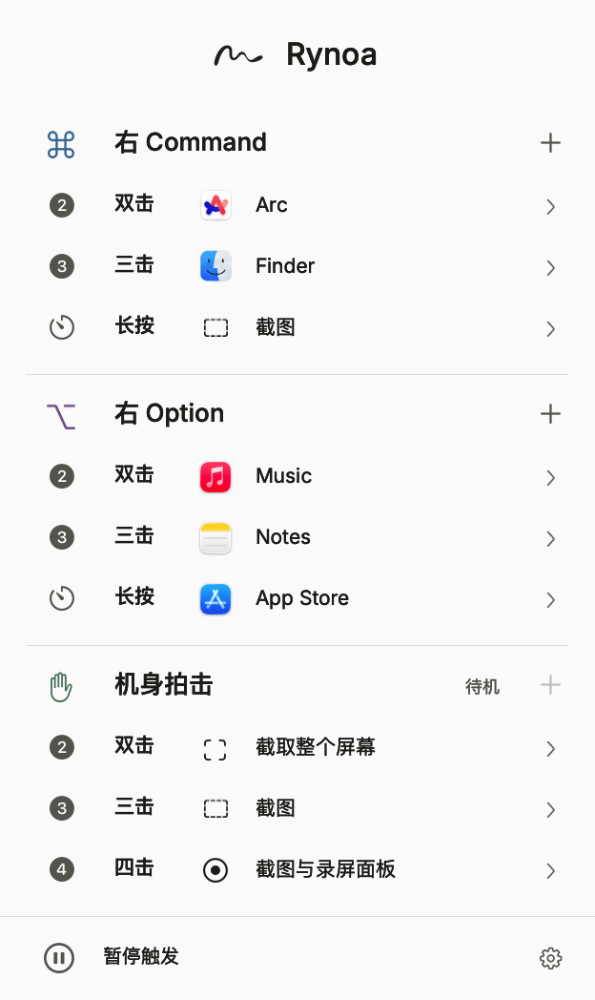

  

<h1 align="center">Rynoa</h1>

<strong>让 Mac 更顺你的手。</strong>

轻按右侧按键，或轻拍 Mac 机身，把常用操作交给一个手势。

  <a href="https://rynoa.jinso.top">官网</a> ·
  <a href="https://github.com/JinSooo/rynoa/releases/download/v1.0.0-beta.7/Rynoa-1.0.0-beta.7.dmg"><strong>下载 Mac 版</strong></a> ·
  <a href="HELP.md">使用指南</a> ·
  <a href="https://github.com/JinSooo/rynoa/issues/new/choose">反馈问题</a>

免费测试版 · macOS 14+ · Apple Silicon / Intel 当前版本 v1.0.0-beta.7

 

  

真实应用界面。图中为示例配置，每个手势都可以换成你常用的动作。

## 一个手势，少几步操作

打开微信、呼出聚焦搜索、截取屏幕、最小化窗口——Rynoa 常驻菜单栏，让这些小事随手完成。

| 触发方式 | 可设置的手势 |
| --- | --- |
| 右 Command ⌘ | 单击、双击、三击、长按 |
| 右 Option ⌥ | 单击、双击、三击、长按 |
| 机身拍击 | 双击、三击、四击，不区分左右 |

每个手势可以独立设置为**打开或切换应用**、**发送自定义组合键**，或**执行系统动作**，如音量、勿扰、截图与窗口操作。随时可以暂停触发；动作配置保存在本机。

机身拍击依赖 Mac 机型和系统，目前验证范围有限，不保证所有 Mac 都支持。轻拍即可，不必用力；不支持拍击的设备仍可使用键盘手势。

## 安装，设置，然后试一下

1. [下载 Rynoa DMG](https://github.com/JinSooo/rynoa/releases/download/v1.0.0-beta.7/Rynoa-1.0.0-beta.7.dmg)，升级前先退出旧版。
2. 打开安装包，将 **Rynoa** 拖到 **Applications**，再从“应用程序”打开。
3. 按首次使用引导，在“系统设置 → 隐私与安全性”允许**输入监控**与**辅助功能**。
4. 点击菜单栏 Rynoa 图标，点击分组标题右侧的 **+** 添加手势，再选择动作。已有绑定直接显示，点击即可修改。

应用与系统动作选中即保存；录制热键后点“完成”。面板关闭后 **5 秒内重新打开**，会回到刚才的页面，保留搜索与尚未提交的热键草稿；超过 5 秒回到主界面。遇到问题可查看[完整使用指南与故障排查](HELP.md)。

> 当前为开发签名测试包，尚未完成 Developer ID 发行签名与 Apple 公证，macOS 可能阻止打开。长期拍击体验、睡眠唤醒和更多机型兼容性仍在验证。

## 免费使用，本地保存

当前测试版**无需购买、注册或激活，没有试用到期限制**。收费计划延期，当前优先完善体验与兼容性。

键盘手势、机身拍击和动作映射可离线使用。映射、偏好和最近选择保存在本机；不记录输入内容，不保存或上传原始拍击信号。手动检查更新会连接 GitHub，在线帮助也需要网络。详见[隐私说明](PRIVACY.md)。

## 更新与反馈

请直接查看 [Releases](https://github.com/JinSooo/rynoa/releases) 获取新版本。仓库已更名，**beta.6 及更早版本的应用内更新检查可能误报“已是最新版本”**，请以 Releases 为准。beta.7 已修复更新地址。应用不会自动下载或安装。更新时退出 Rynoa，用新版本替换“应用程序”中的旧版，再重新打开，其余动作与偏好会保留；beta.7 会清除已移除的六项系统动作绑定，并在本机备份原配置，受影响的手势需要重新设置。

- [版本说明](https://github.com/JinSooo/rynoa/releases/tag/v1.0.0-beta.7) · [完整变更记录](CHANGELOG.md)
- 问题与建议：[提交 Issue](https://github.com/JinSooo/rynoa/issues/new/choose)，请附版本、macOS、Mac 型号与复现步骤。
- 私密问题：[kimjinso@qq.com](mailto:kimjinso@qq.com)。请勿在公开 Issue 上传个人信息、订单或许可证。详见[支持说明](SUPPORT.md)。

---

本仓库提供 Rynoa 的下载、使用说明与反馈入口。应用源码另行维护。[第三方归属](THIRD_PARTY_NOTICES.md)；许可文件随应用提供。
